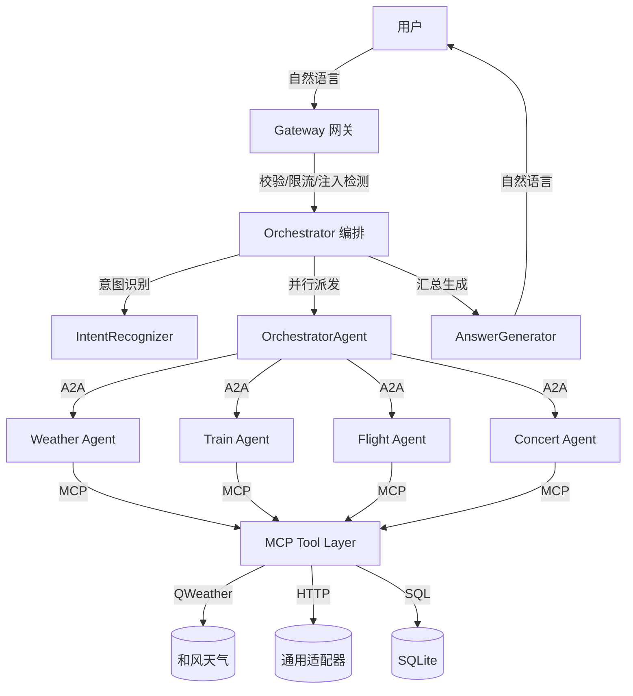

# SmartVoyage 项目最终报告

> 生成时间：2026-07-11
> 测试：**107 passed** · 12 文件 · 0 回归

---

## 1. 项目概要

SmartVoyage 是一个**分层多 Agent 智慧旅行助手**。用户用自然语言查询天气/火车票/飞机票/演唱会，系统自动识别意图、抽取参数、并行调用专业 Agent、通过 MCP 调用工具、汇总生成自然语言回答。

```
用户 → 网关 Gateway → 编排 Orchestrator → A2A → 专业 Agent → MCP → 工具/数据源
```

**技术栈**：Python 3.14 + FastAPI + Pydantic v2 + Vue 3 + Vite + TypeScript + MCP SDK

---

## 2. 完成进度

### 基础设施（接手前已完成）

| 模块 | 功能 |
|---|---|
| 网关层 | `POST /api/v1/query`、`GET /health`、`GET /metrics`、统一错误码脱敏、限流、body 大小限制 |
| A2A 连接层 | 超时控制、未知任务类型、结构化日志 |
| MCP 工具层 | 同进程 + Streamable HTTP 双传输模式 |
| 编排层 | 规则意图识别、参数校验、会话记忆、路由派发、结果汇总 |
| LLM 接入 | OpenAI 兼容（可插拔、默认关闭） |
| SQL 安全 | AC-11 只读校验 |
| 可观测性 | JSON 结构化链路日志 + 内存指标 |
| 前端 | Vue 3 + Vite + TS 聊天式 UI |

### 本次接手实现

| # | 任务 | 优先级 | 文件 |
|---|---|---|---|
| 1 | **接入和风天气 QWeather** | P0 | `app/mcp/sources/weather_qweather.py` |
| 2 | `.env` 配置 + `python-dotenv` | — | `app/core/config.py`, `.env`, `.gitignore` |
| 3 | SSL 兼容 (`verify=False`) | — | 三个 sources 文件 |
| 4 | 日期默认今天 | — | `app/orchestrator/service.py` |
| 5 | **AC-10 多工具并行 + 部分失败** | P1 | `intent.py`, `agent.py`, `service.py` |
| 6 | **契约测试** (A2A/MCP/Handler) | P1 | `tests/test_contracts.py` (23 cases) |
| 7 | **提示词注入防护** | P1 | `app/gateway/security.py` + `tests/test_security.py` (27 cases) |
| 8 | 结果排序/筛选 | P1 | `app/orchestrator/service.py::_sort_results` |
| 9 | Docker 部署 | P1 | `Dockerfile` (多阶段构建) |
| 10 | 调试 CLI 模块 | — | `app/debug.py` |

---

## 3. 验收标准覆盖

| AC | 场景 | 状态 |
|---|---|---|
| AC-01 | 天气查询 | ✅ QWeather 真实数据 |
| AC-02 | 火车票查询 | ✅ |
| AC-03 | 飞机票查询 | ✅ |
| AC-04 | 演唱会查询 | ✅ |
| AC-05 | 参数缺失 | ✅ 友好提示 |
| AC-06 | 参数修改 | ✅ 会话合并 |
| AC-07 | 意图不明确 | ✅ 请求澄清 |
| AC-08 | 数据源无结果 | ✅ 区分无数据/异常 |
| AC-09 | 工具超时 | ✅ A2A/MCP 独立超时 |
| **AC-10** | **部分失败** | **✅ 本次实现** |
| AC-11 | SQL 安全 | ✅ |
| AC-12 | 敏感信息保护 | ✅ 脱敏 + 日志不记录 Key |
| AC-13 | 结果真实性 | ✅ 事实仅来自工具 |
| AC-14 | 链路追踪 | ✅ request_id 透传 |

---

## 4. 测试覆盖

```
107 passed, 1 deselected (SSL 环境问题)

test_a2a.py         3   A2A 调度/超时/未知任务
test_components.py  5   校验/限流/HTTP连接
test_contracts.py   23  契约测试（新增）
test_gateway.py     8   网关接口/限流/错误
test_llm.py         6   LLM 识别/模板生成
test_mcp.py         3   MCP 工具调用/注册
test_observability  3   指标/健康/回答
test_orchestrator   8   编排/多意图（新增4）
test_security.py    27  注入防护（新增）
test_sources.py     11  数据源（新增5 QWeather）
test_sql.py         8   SQL 安全
```

---

## 5. 环境变量一览

| 变量 | 默认值 | 说明 |
|---|---|---|
| `WEATHER_SOURCE` | `open-meteo` | 天气源: `qweather` / `open-meteo` / `demo` |
| `WEATHER_API_KEY` | — | QWeather API Key |
| `QWEATHER_API_HOST` | `devapi.qweather.com` | QWeather 专属 API Host |
| `TRAIN_SOURCE` / `FLIGHT_SOURCE` / `CONCERT_SOURCE` | `demo` | 数据源模式 |
| `LLM_API_KEY` / `LLM_BASE_URL` / `LLM_MODEL` | — | LLM 配置 |
| `MCP_TRANSPORT` | `in-process` | MCP 传输: `in-process` / `streamable-http` |
| `A2A_TIMEOUT_MS` | `12000` | Agent 超时 |
| `MAX_RESULTS` | `20` | 单次最大结果数 |

---

## 6. 运行方式

```bash
# 安装
pip install -r requirements.txt

# 配置 .env（QWeather Key 等）
cp .env.example .env

# 测试
pytest                    # 全量 107 passed

# 调试（无需启动服务）
python -m app.debug all   # 冒烟测试
python -m app.debug weather 广州
python -m app.debug multi "北京天气，上海火车"

# 启动
python -m uvicorn app.main:app --port 8000

# Docker
docker build -t smartvoyage .
docker run -p 8000:8000 --env-file .env smartvoyage
```

---

## 7. 架构图



---

## 8. 待办

| 优先级 | 任务 |
|---|---|
| 🟢 P2 | LLM 意图识别/回答生成开启 |
| 🟢 P2 | 前端历史消息持久化、加载动画 |
| 🔒 | 火车/飞机/演唱会真实 API（需商务合作） |
